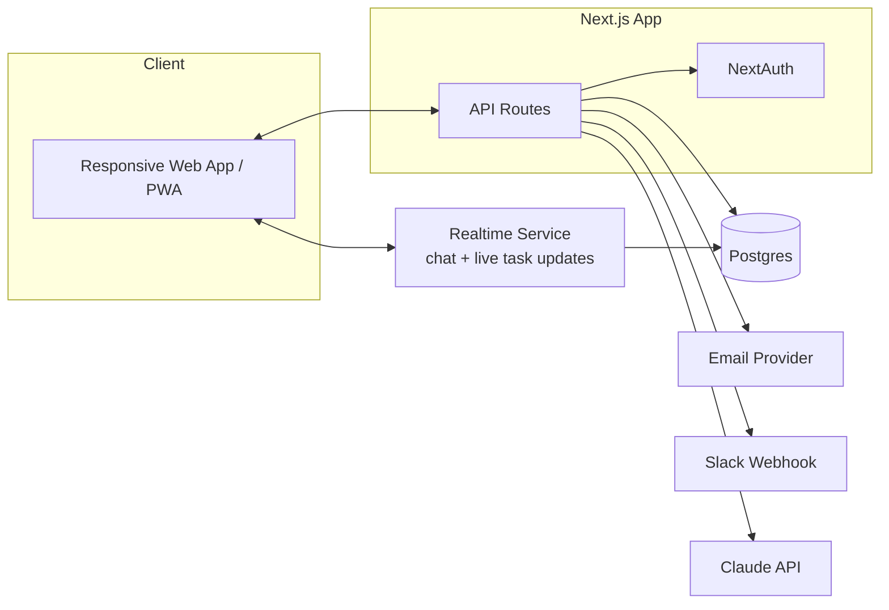
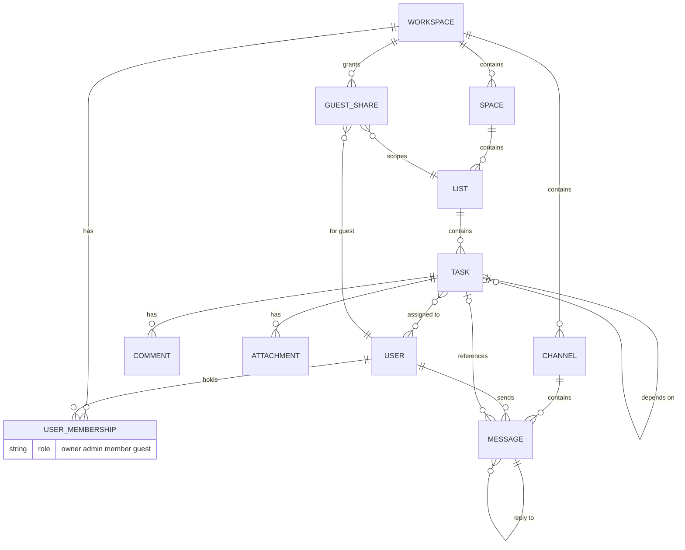

# Architecture

## Stack

| Layer | Choice | Why |
|---|---|---|
| Frontend + API | Next.js (React) | One codebase, server and client routes together, no separate backend service to run |
| Database | Postgres | Relational data (workspace -> space -> list -> task) fits relational, not document |
| ORM | Prisma | Type safe queries, migrations, works well with Next.js |
| Auth | NextAuth | Handles sessions, roles, and guest style restricted accounts without hand rolling auth |
| Styling | Tailwind CSS | Responsive by default, matches the mobile friendly requirement without extra work |
| Realtime | WebSockets (Socket.io or a managed service like Ably/Pusher) | Chat needs real real-time, unlike the task board which can tolerate polling. One realtime layer serves chat and live task updates |
| AI | Claude API | Task summarization, subtask generation, chat draft replies (Phase 2) |
| Notifications | Email (Resend/Postmark) + Slack incoming webhook | Both are simple API calls, no separate notification service needed |
| Hosting | Vercel (app) + managed Postgres (Railway/Neon) | Minimal ops for a small team, scale up only if actually needed |

Decision to reconsider: Socket.io vs a managed realtime service. Socket.io is free and self hosted but is another process to run and scale. A managed service (Ably/Pusher) costs money but removes the ops burden. Default to the managed service for v1, revisit if cost becomes a real issue.

## System diagram

## Data model

Key point: `GUEST_SHARE` is what makes guest access work. A guest user has a membership with role `guest`, and one or more `GUEST_SHARE` rows scoping them to specific lists. Every query that touches task data for a guest filters through their `GUEST_SHARE` rows, not through space level permissions.

## Mobile friendly approach

- Tailwind's responsive utilities handle layout, no separate mobile codebase
- PWA manifest + service worker for installability and basic offline shell
- No native app in v1, revisit only if push notifications or offline editing become a hard requirement
