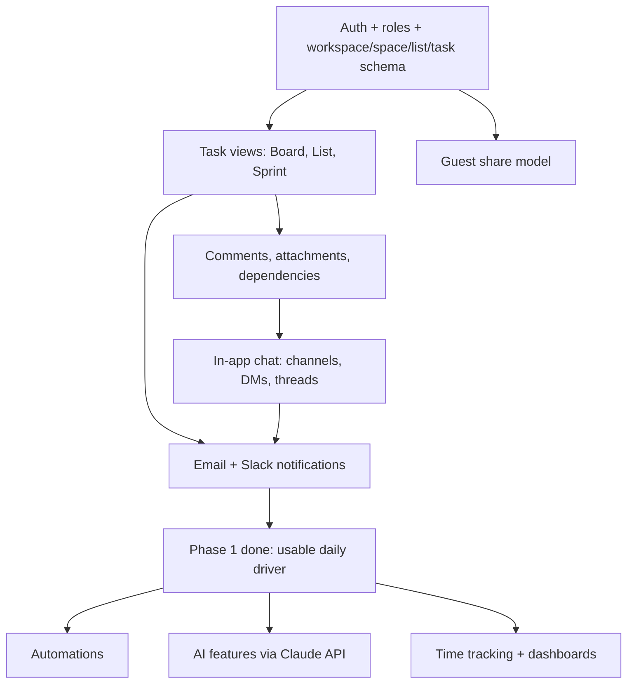

# Roadmap

## Build order

Rationale: auth and the core hierarchy come first because everything else depends on them. Guest share model comes early too, since retrofitting permissions after the fact is expensive. Chat depends on comments/tasks existing so task references in chat have something to link to.

## Open questions

- Realtime provider: self hosted Socket.io vs managed (Ably/Pusher). Default is managed for v1, see [Architecture](02-architecture.md).
- Email provider: Resend vs Postmark, pick based on existing accounts/pricing.
- Does the team need SSO (Google Workspace login) or is email/password enough for v1.
- File storage for attachments: S3 compatible bucket, provider not yet chosen.

## Definition of done for Phase 1

- A team member can create a workspace, invite members, and set up spaces/lists
- Tasks can be created, assigned, moved across board/list/sprint views, and commented on
- A guest can be given access to one list and only see that list
- Chat works: channels, DMs, threads, task links unfurl
- Notifications fire over email, and over Slack if the workspace enabled it
- The app is usable on a phone browser without horizontal scrolling or broken layout
